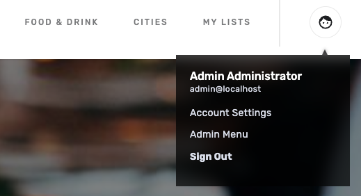
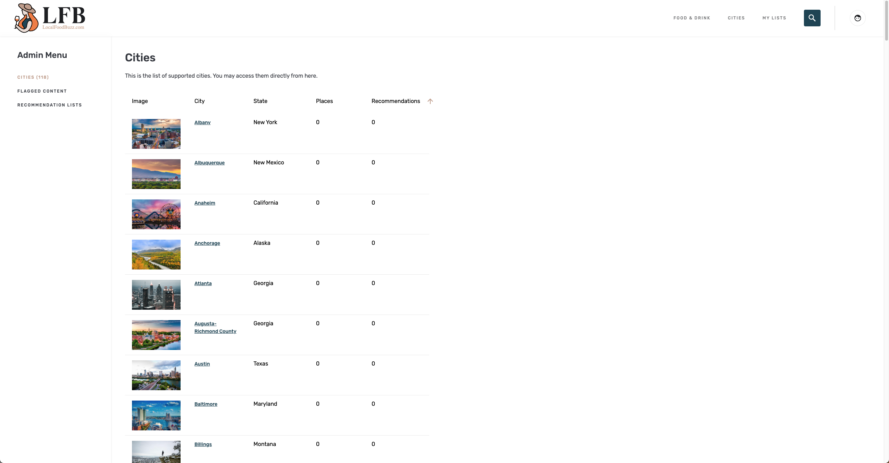
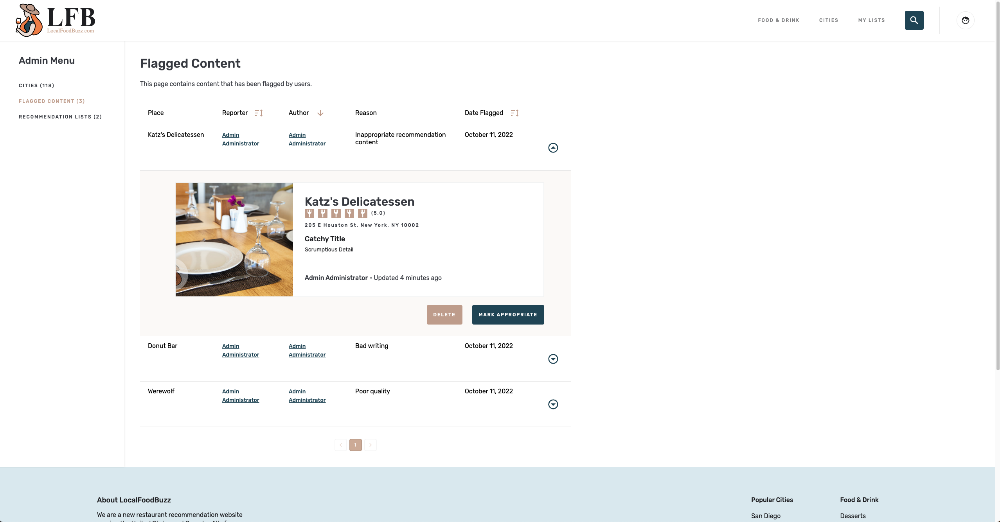
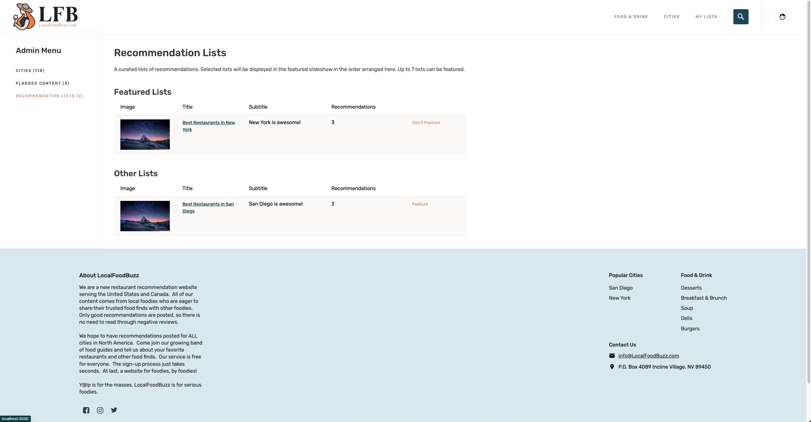
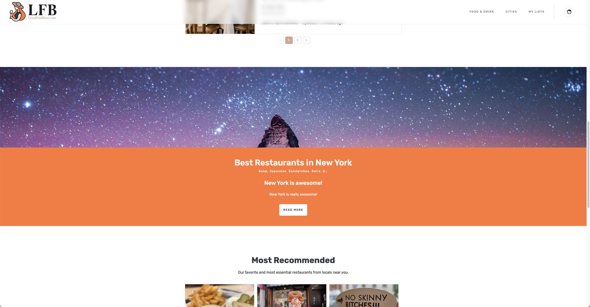
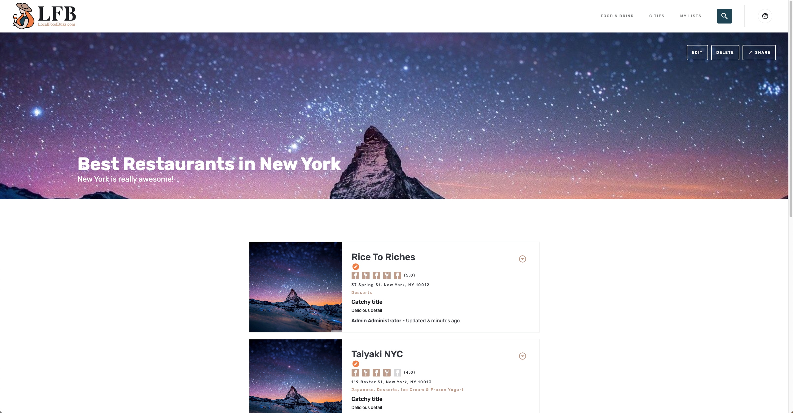
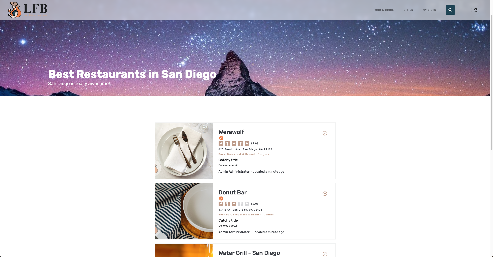

# README

This README file documents the necessary steps to set up the client-side application for LFB.

### List of Related Repositories

-   Client-side (Current Repository)
    -   https://bitbucket.org/SeamgenSD/aatl-web/
-   Services
    -   https://bitbucket.org/SeamgenSD/aatl-services/
-   Keycloak
    -   https://bitbucket.org/SeamgenSD/aatl-keycloak/
-   Development
    -   https://bitbucket.org/SeamgenSD/aatl-development/

### How do I get set up?

-   Install all packages by running the following command in the root directory of this repository:
    > npm install
-   Ensure that the local database, services, and keycloak are running
-   Start the local client server by running the following command:
    > npm run dev

### Deployment

-   Note that we have **QA**, **Staging**, and **Production** environments for this project
-   Each environment is built from a pipeline, listening to their respective branch on Bitbucket as follows:
-   QA environment (www-qa.localfoodbuzz.com) listening to branch:
    > qa
-   Staging environment (www-staging.localfoodbuzz.com) listening to branch:
    > staging
-   Production environment (www.localfoodbuzz.com) listening to branch:
    > master
-   In order to deploy to any of the above environment, create and merge a PR to any of the above branch. This will trigger a codebuild to deploy the latest code to the environment with the newly introduced code.
-   Best order for code deployment is as follows:
    > develop ==> qa ==> staging ==> master

### Example Workflow

-   Create a new branch off the latest branch of **develop**
-   Modify code. Test locally.
-   Create a PR of the new branch into **develop**
-   Merge the PR. Now, the **develop** is updated.
-   Create a PR of **develop** into **qa**
-   Merge the PR and verify the changes on www-qa.localfoodbuzz.com
-   Once the changes are verified, create a PR of **qa** into **staging**
-   Merge the PR and verify the changes on www-staging.localfoodbuz.com
-   Once the changes are verified, create a PR of **staging** into **master**
-   Merge the PR and verify the changes on www.localfoodbuzz.com

### Quick Fixes

-   All of the constant string values can be found in **src/StringConstants.js**

### Admin User Controls

-   Admin users have the ability to access **Admin Menu** as shown in the image below.
    

#### Admin - Cities

-   Admin users can view the list of cities within our LFB system as shown below:
    
-   Cities are rendered in alphabetical order by default. Admin users can also sort the viewed list into the number of recommendations that exist in each city by descending/ascending order by clicking on the arrow in the **Recommendations** column in the table.

#### Admin - Flagged Content

-   Admin users can view all of the flagged recommendations and choose to either **Delete** the recommendation or **Mark Appropriate** as shown in the image below. Deleting a recommendation will remove the recommendation from the system, and the users will not be able to view the recommendation anymore. Marking a recommendation appropriate will let the recommendation stay in the system and remove the flag on the recommendation.
    

#### Admin - Featured Lists

-   Admin users can view all of the recommendations list that exist in the system. Admin users can either feature or unfeature a recommendation list by clicking on **Feature** and **Don't Feature** buttons displayed next to the list or by dragging a list up and down into the **Featured Lists** or **Other Lists** section.
    
-   Featuring a recommendation list will display the list in the home banner section as shown in the image below:
    
-   By either clicking on the list's hyperlink in the **Admin - Feature List** view or by clicking **READ MORE** button in the featured list's detail displayed in the home banner, admin users can view the details about the recommendation list just like any other user. However, admin users have more control once at the list's detail page, which are **EDIT** and **DELETE**.
    
    
